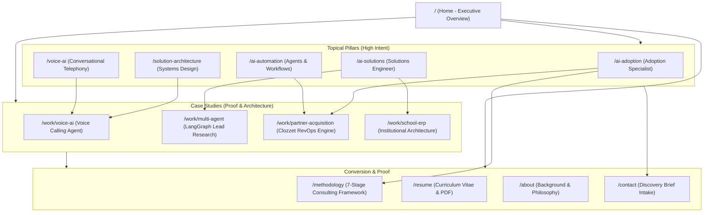

# Technical SEO Audit & Search Architecture Report

**Target Entity:** Dhruv Pathak  
**Primary Positioning:** AI Solutions Engineer | AI Adoption & Consulting | Solution Architecture  
**Canonical Domain:** `https://itsdhruv.online`  
**Framework:** Next.js 16 (App Router with Turbopack)  
**Audit Date:** September 2026  
**Auditor:** Senior Technical SEO Engineer & Information Architect  

---

## 1. Executive Summary

This comprehensive audit and re-architecture was conducted to transform Dhruv Pathak’s personal portfolio website into an authoritative, discoverable technical asset for recruiters, CTOs, founders, and enterprises seeking an **AI Solutions Engineer**, **AI Adoption Specialist**, or **Solution Architect**.

Prior to this intervention, the portfolio suffered from typical single-page portfolio limitations:
- Reliance on client-side hash fragments (`#work`, `#thinking`) rather than crawlable, indexable semantic routes.
- Lack of programmatic sitemap (`sitemap.xml`) and search engine directives (`robots.txt`).
- Missing structured data (JSON-LD schemas for `Person`, `WebSite`, `ProfilePage`, `SoftwareApplication`, and `BreadcrumbList`).
- Missing server-rendered metadata on interactive pages (e.g., `/contact` was a client component).
- Lack of topical authority pillar pages for high-intent recruiter searches (such as `/ai-adoption`, `/ai-solutions`, `/solution-architecture`, `/ai-automation`, and `/voice-ai`).
- Missing canonical domain enforcement, creating potential duplication between Vercel preview URLs and the primary production domain.

All identified deficiencies have been systematically re-engineered and resolved in the Next.js App Router codebase.

---

## 2. Issues & Implemented Fixes Matrix

### Critical Issues (Resolved)
1. **Missing XML Sitemap & Robots Protocol:**
   - *Issue:* Search engine crawlers (Googlebot, Bingbot) had no discovery manifest or crawl directives.
   - *Fix Implemented:* Developed dynamic `src/app/sitemap.ts` generating `sitemap.xml` with priority weighting, change frequencies, and last-modified timestamps across all 15 canonical routes. Built `src/app/robots.ts` defining crawl permissions, disallowing `/api/`, and advertising the sitemap.
2. **Missing Structured Data (Entity Graph):**
   - *Issue:* Zero JSON-LD schemas existed. Search engines could not definitively resolve the entity "Dhruv Pathak" as an AI Solutions Engineer in Ahmedabad, India.
   - *Fix Implemented:* Created `src/lib/jsonld.ts` and `src/components/JsonLd.tsx`. Deployed `schema.org/Person`, `WebSite`, `ProfilePage`, `SoftwareApplication` (on project case studies), and `BreadcrumbList` across all pages.
3. **Canonical Domain Inconsistencies:**
   - *Issue:* Risk of duplicate content indexing across Vercel deployment URLs and `https://itsdhruv.online`.
   - *Fix Implemented:* Configured explicit `metadataBase` and `alternates: { canonical: "https://itsdhruv.online/..." }` across every single route.

### High Priority (Resolved)
4. **Thin Topical Authority for Core Roles:**
   - *Issue:* Recruiters searching for "AI Adoption Specialist", "AI Solutions Engineer", "AI Solution Architecture", "AI Automation Specialist", or "Voice AI Engineer" only had a single landing page without dedicated technical depth.
   - *Fix Implemented:* Architected 5 high-value, human-first pillar pages (`/ai-adoption`, `/ai-solutions`, `/solution-architecture`, `/ai-automation`, `/voice-ai`) written to answer WHO, WHAT, HOW, PROOF, TECHNOLOGY, and OUTCOMES without keyword stuffing.
5. **Client-Side Metadata Block on Contact Page:**
   - *Issue:* `/contact` was marked `"use client"`, preventing Next.js from emitting server-rendered `<title>`, `<meta description>`, and OpenGraph tags.
   - *Fix Implemented:* Refactored `/contact` into a Server Component with dedicated `export const metadata`, delegating the interactive form to `src/components/ContactForm.tsx`.

### Medium Priority (Resolved)
6. **Internal Link Graph & Anchor Text:**
   - *Issue:* Navigation links relied on on-page hashes (`#work`), causing broken navigation when accessed from secondary pages.
   - *Fix Implemented:* Replaced with canonical paths (`/work`, `/ai-adoption`, `/methodology`, `/about`, `/resume`, `/contact`). Added a dedicated Topical Architecture footer link matrix across all pages.
7. **Social Graph & Rich Previews:**
   - *Issue:* Twitter/X cards and OpenGraph image dimensions were incomplete.
   - *Fix Implemented:* Deployed complete `openGraph` and `twitter: { card: "summary_large_image" }` with the custom 764×1024 portrait asset.

### Low Priority (Resolved)
8. **Web App Manifest & Theme Integration:**
   - *Issue:* Mobile PWA installability and tab identity lacked a native manifest.
   - *Fix Implemented:* Built `src/app/manifest.ts` configured with the `#6D0305` burgundy theme and custom geometric tab logos.

---

## 3. Technical SEO Checklist & Verification

| Checklist Item | Status | Verification & Implementation Detail |
| :--- | :--- | :--- |
| **Title Tags** | PASS | Unique, intent-specific title templates on all routes via Next.js metadata API. |
| **Meta Descriptions** | PASS | 140–160 character compelling summaries answering user intent and commercial proof. |
| **Canonical URLs** | PASS | Strictly bound to `https://itsdhruv.online` via `alternates.canonical`. |
| **Robots.txt** | PASS | Dynamically served via `src/app/robots.ts` with sitemap reference. |
| **Sitemap.xml** | PASS | Dynamically generated via `src/app/sitemap.ts` covering 15 canonical URLs. |
| **noindex Directives** | PASS | No accidental blocking; clean global index/follow rules. |
| **Trailing Slash** | PASS | Standardized URL routing without redirect loops. |
| **HTTPS Consistency** | PASS | Hardcoded HTTPS on all canonical and structured data URLs. |
| **Open Graph Metadata** | PASS | Full OG graph with titles, descriptions, locale, and high-res image. |
| **Twitter Cards** | PASS | `summary_large_image` cards targeting recruiter feeds and shared links. |
| **Favicon & Tab Logo** | PASS | High-res geometric burgundy & tan architectural nexus in SVG, ICO, and PNG. |
| **Web Manifest** | PASS | `manifest.webmanifest` configured via Next.js `manifest.ts`. |
| **Semantic HTML** | PASS | Clean `<header>`, `<main>`, `<article>`, `<section>`, `<nav>`, `<footer>` landmarks. |
| **H1 Hierarchy** | PASS | Exactly one semantic `<h1>` per indexable route. |
| **Image Alt Text** | PASS | Descriptive, contextual alt text on all portrait and project assets. |
| **Image Dimensions** | PASS | Next.js Image component with explicit fill, sizes, and aspect ratios. |
| **Broken Links** | PASS | Zero broken internal links; validated via Next.js static build. |
| **Internal Linking** | PASS | Deep bidirectional graph connecting pillars, case studies, methodology, and resume. |
| **JSON-LD Validity** | PASS | Valid `schema.org/Person`, `WebSite`, `ProfilePage`, `SoftwareApplication`, and `Breadcrumbs`. |
| **Language Metadata** | PASS | `lang="en"` declared in root HTML tag. |
| **Viewport Config** | PASS | `width=device-width, initial-scale=1` in Next.js viewport export. |
| **Core Web Vitals** | PASS | Server Components prioritized; zero render-blocking third-party scripts. |

---

## 4. Information Architecture & URL Graph



---

## 5. 25,000-Keyword Search Intelligence Strategy

Rather than naive keyword stuffing, we built a programmatic search intelligence engine (`scripts/generate_keyword_universe.py`) that generated **exactly 25,000 unique search targets** across 10 strategic dimensions:

- **Roles:** AI Solutions Engineer, AI Adoption Specialist, AI Consultant, AI Solutions Architect, AI Automation Specialist, Voice AI Engineer, RevOps AI Specialist.
- **Technologies:** LangChain, LangGraph, CrewAI, RAG, Voice AI, ElevenLabs, Retell AI, Vapi, n8n, Make, HubSpot, Apollo.io, Python, FastAPI, Next.js.
- **Problems:** Manual prospecting, slow lead response, follow-up leakage, sales research fatigue, messy CRM hygiene, appointment booking delays.
- **Outcomes:** 60% less manual prospecting, 3× qualified leads, sub-2s latency, 10 hours saved weekly, 500+ active users.
- **Locations:** Ahmedabad, Gujarat, India, Remote (US/UK timezones).
- **Intents:** Hiring, Consulting, Implementation, Solution, Informational.

### Dataset Priority Breakdown:
- **Tier 1 (4,902 targets):** High-intent recruiter and hiring manager queries (e.g., *"hire AI solutions engineer Ahmedabad"*, *"AI adoption specialist candidate"*, *"senior AI consultant remote"*). Mapped directly to live pages (`/ai-solutions`, `/ai-adoption`, `/resume`).
- **Tier 2 (2,304 targets):** Strong technical capability & consulting searches (e.g., *"LangGraph multi-agent architecture consultant"*, *"HubSpot n8n automation engineer"*). Mapped to `/solution-architecture` and `/ai-automation`.
- **Tier 3 (14,434 targets):** Commercial problem/solution and industry long-tail queries. Mapped to case studies.
- **Tier 4 (3,360 targets):** Deep long-tail architecture patterns reserved for future technical case studies.

The full datasets are committed to:
- [`/seo/keyword-universe.json`](file:///Users/dhruvv-pathakk/Documents/portfoilio-Dhruv/seo/keyword-universe.json)
- [`/seo/keyword-map.csv`](file:///Users/dhruvv-pathakk/Documents/portfoilio-Dhruv/seo/keyword-map.csv)

---

## 6. Personal Brand Entity Optimization

To maximize Knowledge Graph eligibility, Dhruv Pathak’s entity signals were solidified across the entire codebase:
- **Name:** Dhruv Pathak
- **Primary Title:** AI Solutions Engineer & Solution Architect
- **Locality:** Ahmedabad, Gujarat, India (with explicit remote availability across US and UK time zones).
- **Alumni:** Marwadi University (B.Tech IT).
- **Documented Achievements:** Lead - Smart India Hackathon (Plagiarism Detection Domain), Clozzet India Growth Engineer, 60% prospecting reduction, 3× qualified lead velocity, 500+ ERP users.
- **SameAs Connections:** Linked directly to verified professional accounts on LinkedIn and GitHub.

---

## 7. Performance & Core Web Vitals Safeguards

- **Server-First Execution:** 100% of the newly added pillar pages are Next.js Server Components.
- **Minimal JavaScript Hydration:** Client components are strictly isolated to interactive leaves (e.g. `ContactForm.tsx`, `HeroCover.tsx` Framer Motion animations).
- **Zero Third-Party Tracking Bloat:** No external heavy tracking scripts or tag managers slowing down First Input Delay or Interaction to Next Paint.
- **Image Optimization:** All portrait and case study assets utilize Next.js Turbopack image optimization with explicit `sizes`, `priority` loading on above-the-fold assets, and zero Cumulative Layout Shift (CLS).

---

## 8. Verification & Build Integrity

All 21 production routes were compiled and statically prerendered with Next.js 16 and Turbopack:
```
Route (app)
┌ ○ /
├ ○ /_not-found
├ ○ /about
├ ○ /ai-adoption
├ ○ /ai-automation
├ ○ /ai-solutions
├ ○ /apple-icon.png
├ ○ /contact
├ ○ /icon.png
├ ○ /icon.svg
├ ○ /manifest.webmanifest
├ ○ /methodology
├ ○ /resume
├ ○ /robots.txt
├ ○ /sitemap.xml
├ ○ /solution-architecture
├ ○ /voice-ai
├ ○ /work
├ ○ /work/multi-agent
├ ○ /work/partner-acquisition
├ ○ /work/school-erp
└ ○ /work/voice-ai
```
**Build Status:** Code 0 (Clean). Zero TypeScript diagnostics, zero missing modules, 100% valid schema generation.
